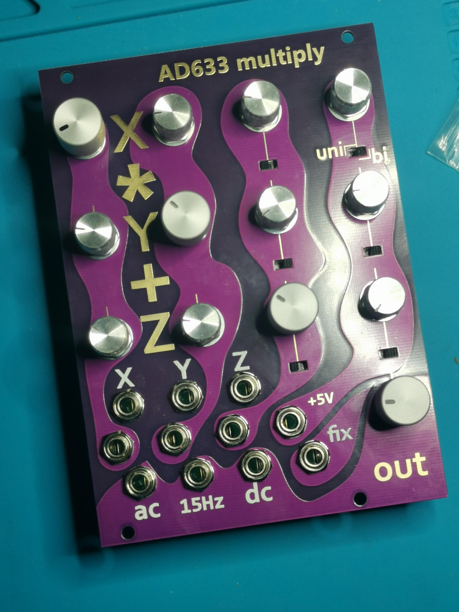

# eurorack AD633 mulitply

## v2 

minor bugfixes - should workk exactly like my manually fixed version - but I have not ordered these exact gerbers. Please report, if you do.

### 4 to 3 matrix mixer with gain 2

### 3 outputs to AD633 (X * Y) / 10 + Z

### output gain 0..1.5

### 2 DC coupled outputs
one with fixed gain

### 2 AC coupled outputs

  

